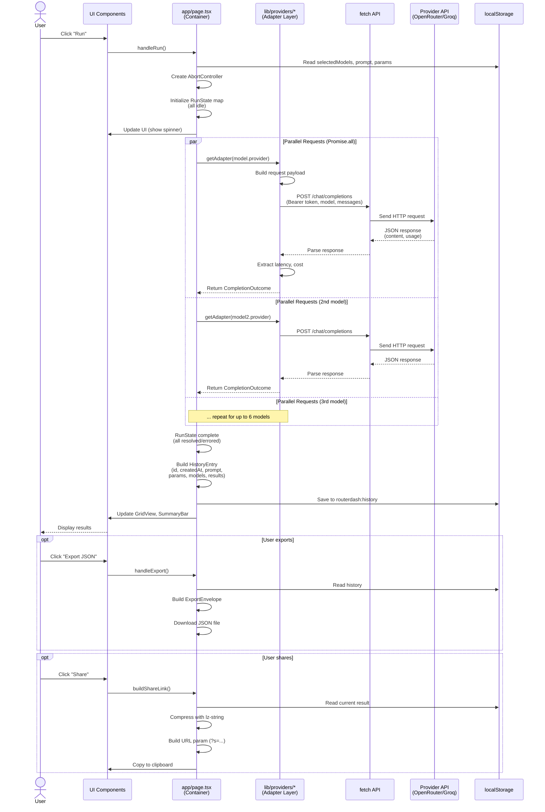
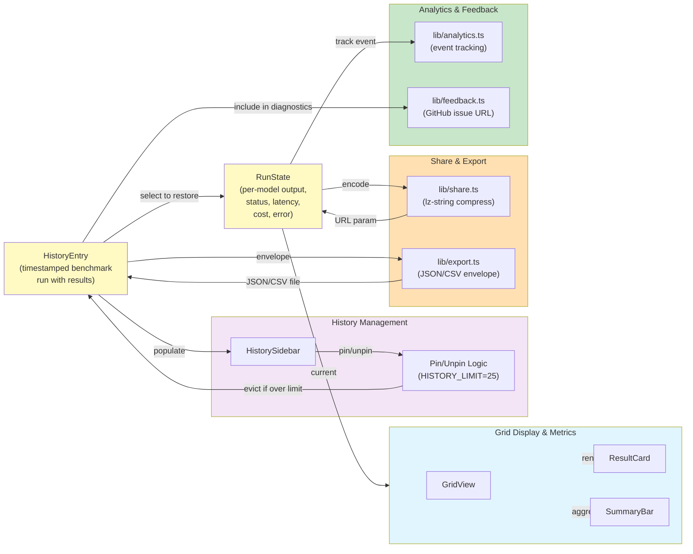

# RouterDash — Complete Codebase Knowledge Base

**Purpose:** A single, self-contained reference for understanding, implementing, fixing, and refactoring RouterDash. Designed for LLMs (or humans) to read once and confidently modify any part of the system.

**Last Updated:** August 2026  
**Repository:** https://github.com/andymagill/router-dash

---

## Table of Contents

1. [High-Level Overview](#high-level-overview)
2. [Tech Stack & Repository Structure](#tech-stack--repository-structure)
3. [Architecture Deep Dive](#architecture-deep-dive)
4. [Feature-by-Feature Analysis](#feature-by-feature-analysis)
5. [Nuances, Subtleties & Gotchas](#nuances-subtleties--gotchas)
6. [Glossary & Technical Reference](#glossary--technical-reference)
7. [Cross-Feature Interaction Map](#cross-feature-interaction-map)

---

## High-Level Overview

### What RouterDash Is

RouterDash is a **browser-based LLM benchmarking playground** that lets developers compare AI models side by side, **without ever trusting a server with their API keys**.

**Target users:** AI/ML engineers, API consumers, prompt engineers who want to:
- Test multiple LLM models (from OpenRouter or Groq) with the same prompt
- Compare response quality, latency, token usage, and estimated cost
- Save benchmark runs to history for later review or sharing
- Export results as JSON or CSV for analysis

**Business purpose:** Lower friction for users to make informed model-selection decisions by providing instant, cost-aware side-by-side comparisons in a browser.

### Core Value Propositions

1. **BYOK (Bring Your Own Key)** — Users provide their own API keys; RouterDash never stores, logs, or transmits them through any server. All API calls go directly from the browser to the provider (OpenRouter or Groq). **Security by architecture, not policy.**

2. **Real-time parallel benchmarking** — Select up to 6 models and run a single prompt across all of them simultaneously in the browser. Results stream in as each model completes.

3. **Cost-aware comparison** — Automatically calculates per-model token usage and estimated USD cost (where pricing data is available), helping users optimize spend.

4. **Persistent history & sharing** — Results are saved locally in browser storage. Runs can be pinned to prevent eviction, exported for external analysis, or shared via URL (compressed, optionally truncated to fit URL length limits).

5. **Multi-provider extensible architecture** — Currently supports OpenRouter (broad model catalog, public listing) and Groq (fast inference). New providers can be added by implementing the `ProviderAdapter` interface.

### How Features Relate

The app is built around **runs**: a `RunState` represents a single model's output from a benchmark, and a `HistoryEntry` is a timestamped collection of runs (one per selected model). These core types flow through every feature:

```
User selects models & prompt
    ↓ ModelPicker, PromptPanel
Handler runs benchmark (handleRun)
    ↓ calls ProviderAdapter for each model in parallel
Each model completes → RunState emitted
    ↓ displayed in GridView, ResultCard, SummaryBar (real-time)
Run finishes → HistoryEntry saved to history
    ↓ available in HistorySidebar, shareable/exportable
User can share link (SharePayload) or export (ExportEnvelope)
```

---

## Tech Stack & Repository Structure

### Core Stack

- **Framework:** Next.js 16.3.0 (App Router, React 19.2.4)
- **Language:** TypeScript 5.7.3 (strict mode)
- **Package Manager:** pnpm (with `pnpm-lock.yaml`)
- **Styling:** Tailwind CSS v4 (CSS-first, `@import` syntax in `app/globals.css`)
- **UI Components:** shadcn/ui (style: `base-nova`, built on `@base-ui/react`)
- **Icons:** lucide-react
- **Toast Notifications:** sonner
- **Command Palette:** cmdk
- **Data Fetching:** SWR (with localStorage caching layer)
- **Compression:** lz-string (for URL share links)
- **Testing:** Vitest 4.1.10 (node environment, no E2E tests)
- **Deployment:** Vercel (v0.app auto-deploy on main branch)

### Directory Structure

```
router-dash/
├── app/                         # Next.js App Router root
│   ├── layout.tsx              # Root HTML layout, fonts, TooltipProvider, Analytics
│   ├── page.tsx                # **Main application container** (840 lines, all state & orchestration)
│   └── globals.css             # Tailwind v4 config, theme tokens (oklch)
│
├── components/
│   ├── router-dash/            # Feature-specific UI components (13 files)
│   │   ├── api-key-dialog.tsx
│   │   ├── grid-view.tsx
│   │   ├── header.tsx
│   │   ├── history-sidebar.tsx
│   │   ├── model-picker.tsx
│   │   ├── params-sheet.tsx
│   │   ├── prompt-panel.tsx
│   │   ├── provider-badge.tsx
│   │   ├── result-card.tsx
│   │   ├── results-toolbar.tsx
│   │   └── summary-bar.tsx
│   ├── ui/                     # shadcn/ui primitives (24 files: button, dialog, sheet, etc.)
│   ├── code-block.tsx          # Custom syntax-highlighted code block renderer
│   └── markdown.tsx            # Custom lightweight Markdown parser (headings, lists, code)
│
├── hooks/
│   ├── use-local-storage.ts    # Custom hook: useState + localStorage sync
│   └── use-theme.ts            # Dark/light theme toggle
│
├── lib/
│   ├── types.ts                # Core types (RunState, HistoryEntry, ViewMode)
│   ├── presets.ts              # Canned prompt presets (code-refactor, json-extract, etc.)
│   ├── share.ts                # lz-string encode/decode for URL share params
│   ├── export.ts               # JSON/CSV export + import validation
│   ├── analytics.ts            # Vercel Analytics wrapper (allowlist + redact)
│   ├── feedback.ts             # GitHub issue URL builder (safe diagnostics)
│   ├── diff.ts                 # LCS-based line diff **[ORPHANED: UI removed in a615408]**
│   ├── format.ts               # Number/cost/latency formatting helpers
│   ├── utils.ts                # cn() helper (clsx + tailwind-merge)
│   ├── openrouter.ts           # Back-compat re-export shim + vendor label map
│   │
│   ├── providers/              # **Provider abstraction layer (core domain logic)**
│   │   ├── types.ts            # UnifiedModel, ProviderAdapter, RunParams, identity helpers
│   │   ├── index.ts            # Registry: ADAPTERS, getAdapter(), loadCatalog()
│   │   ├── openrouter.ts       # OpenRouter adapter (public catalog, openai-compat)
│   │   ├── groq.ts             # Groq adapter (key-gated catalog, openai-compat)
│   │   ├── openai-compat.ts    # Shared HTTP dispatcher for openai-compatible endpoints
│   │   ├── errors.ts           # ProviderError + aggressive sanitization/redaction
│   │   ├── compat.ts           # Chat-compatibility filters, vendor slug derivation
│   │   ├── catalog-cache.ts    # localStorage TTL cache (1-hour TTL, versioned)
│   │   └── __tests__/          # Unit tests for providers (4 test files)
│   │
│   └── __tests__/              # Unit tests for lib/ (3 test files: analytics, export, share)
│
├── public/                      # Static assets (og-image.png)
│
├── codebase-analysis-docs/      # **This documentation** (generated)
│   ├── CODEBASE_KNOWLEDGE.md   # Master reference (this file)
│   └── assets/                  # Mermaid diagrams
│       ├── architecture-overview.mmd
│       ├── data-flow.mmd
│       └── feature-interaction.mmd
│
├── next.config.mjs              # typescript.ignoreBuildErrors: true, images.unoptimized
├── tsconfig.json                # Strict mode, path alias @/*
├── postcss.config.mjs           # @tailwindcss/postcss plugin
├── components.json              # shadcn/ui config
├── package.json                 # Scripts: dev, build, start, lint, test
├── pnpm-lock.yaml               # Locked dependencies
└── README.md                    # Generic v0.app boilerplate (auto-deploys on main)
```

### Key Build Scripts

```bash
pnpm dev          # Next.js dev server (port 3000)
pnpm build        # Next.js build (outputs to .next/)
pnpm start        # Serve built app
pnpm test         # Run Vitest (vitest run)
pnpm test:watch   # Vitest in watch mode
pnpm lint         # ESLint
```

### Notable Dependency Choices

- **No backend SDK imports** — No `openai`, `@anthropic-ai/sdk`, `groq-sdk`. All HTTP calls are hand-rolled `fetch()` against OpenAI-compatible REST endpoints for maximum simplicity and control.
- **No global state manager** — No Redux, Zustand, or Recoil. State is centralized in `app/page.tsx` and persisted via `useLocalStorage` hook.
- **No markdown/syntax-highlight libraries** — Custom regex-based Markdown parser (`components/markdown.tsx`) and tokenizer-based syntax highlighter (`components/code-block.tsx`) to avoid dependencies.
- **next-themes in dependencies but unused** — The custom `use-theme.ts` hook manages theme directly; next-themes is present but not used (low priority cleanup).
- **typescript.ignoreBuildErrors: true in next.config** — Type errors won't fail the build; relies on pre-commit linting for safety.

---

## Architecture Deep Dive

### High-Level Architecture Diagram

```mermaid
graph TB
    subgraph UI["Frontend Components"]
        Header["Header<br/>(logo, theme toggle)"]
        ModelPicker["ModelPicker<br/>(select up to 6 models)"]
        PromptPanel["PromptPanel<br/>(prompt text, presets)"]
        ParamsSheet["ParamsSheet<br/>(system prompt, temp, topP, maxTokens)"]
        ApiKeyDialog["ApiKeyDialog<br/>(store provider keys)"]
        GridView["GridView<br/>(results grid A/B/C...)"]
        SummaryBar["SummaryBar<br/>(aggregate metrics)"]
        ResultCard["ResultCard<br/>(per-model output)"]
        HistorySidebar["HistorySidebar<br/>(run history)"]
        ResultsToolbar["ResultsToolbar<br/>(share, export)"]
    end

    subgraph Container["Container (app/page.tsx)"]
        AppState["App State<br/>(models, prompt, keys,<br/>history, results)"]
        HandleRun["handleRun()<br/>(orchestrate benchmark)"]
        History["History Manager<br/>(pin, delete, select)"]
        Share["Share Handler<br/>(encode/decode)"]
        Export["Export Handler<br/>(JSON/CSV)"]
    end

    subgraph Providers["Provider Abstraction (lib/providers/)"]
        Registry["Registry (index.ts)<br/>getAdapter(),<br/>loadCatalog()"]
        OpenRouter["OpenRouter Adapter<br/>(openrouter.ts)"]
        Groq["Groq Adapter<br/>(groq.ts)"]
        OpenAICompat["Shared HTTP Dispatch<br/>(openai-compat.ts)"]
        ErrorHandling["Error Sanitization<br/>(errors.ts)"]
        CatalogCache["Catalog Cache<br/>(catalog-cache.ts)"]
    end

    subgraph Storage["Storage & Persistence"]
        LocalStorage["localStorage<br/>(routerdash:keys,<br/>routerdash:models,<br/>routerdash:history,<br/>routerdash:prompt, etc.)"]
        SWRCache["SWR Cache<br/>(model catalogs)"]
    end

    subgraph External["External APIs"]
        OpenRouterAPI["OpenRouter API<br/>https://openrouter.ai/api/v1"]
        GroqAPI["Groq API<br/>https://api.groq.com/openai/v1"]
    end

    subgraph CrossCutting["Cross-Cutting Concerns"]
        Analytics["Analytics (lib/analytics.ts)<br/>(allowlist + redact)"]
        Feedback["Feedback (lib/feedback.ts)<br/>(GitHub issue builder)"]
        Theming["Theming (use-theme.ts)<br/>(dark/light mode)"]
    end

    Header -.-> AppState
    ModelPicker -.-> AppState
    PromptPanel -.-> AppState
    ParamsSheet -.-> AppState
    ApiKeyDialog -.-> AppState
    GridView -.-> AppState
    SummaryBar -.-> AppState
    ResultCard -.-> AppState
    HistorySidebar -.-> AppState
    ResultsToolbar -.-> AppState

    AppState -->|trigger| HandleRun
    HandleRun -->|load models| Registry
    Registry -->|cache| CatalogCache
    Registry -->|dispatch| OpenRouter
    Registry -->|dispatch| Groq
    OpenRouter -->|send request| OpenAICompat
    Groq -->|send request| OpenAICompat
    OpenAICompat -->|http| OpenRouterAPI
    OpenAICompat -->|http| GroqAPI
    OpenAICompat -->|sanitize errors| ErrorHandling
    HandleRun -->|store results| AppState
    AppState -->|persist| LocalStorage
    AppState -->|track event| Analytics
    AppState -->|build URL| Feedback
    AppState -->|toggle| Theming

    History -->|read/write| LocalStorage
    Share -->|read/write| LocalStorage
    Export -->|read| LocalStorage
    SWRCache -->|back| Registry

    style UI fill:#e1f5fe
    style Container fill:#fff3e0
    style Providers fill:#f3e5f5
    style Storage fill:#e8f5e9
    style External fill:#ffebee
    style CrossCutting fill:#f1f8e9
```



### Client-Only Architecture

**There is no backend server.** RouterDash has:
- **No `app/api/` routes** — zero server endpoints
- **No database** — all state lives in browser localStorage
- **No server-side secrets management** — API keys are never sent to any RouterDash infrastructure
- **No sessions or user accounts** — each browser session is independent

This is deliberate: the app is designed so that **all LLM API calls are made directly from the browser to the provider using the user's own key**. This eliminates any trust assumption in RouterDash infrastructure and simplifies deployment (static Next.js export to Vercel).

### Data Flow: A Complete Benchmark Run



### State Management: "One Big Container" + localStorage

**Pattern:** No Redux, Zustand, or Context API for app state. All state (models, prompt, keys, history, results) lives in `app/page.tsx` as React component state and is synced to `localStorage` via the `useLocalStorage` hook.

**How it works:**

1. **Main container state** (`app/page.tsx`):
   ```typescript
   const [selectedModels, setSelectedModels] = useLocalStorage("routerdash:models", [])
   const [prompt, setPrompt] = useLocalStorage("routerdash:prompt", "")
   const [apiKeys, setApiKeys] = useLocalStorage("routerdash:keys", {})
   const [history, setHistory] = useLocalStorage("routerdash:history", [])
   const [results, setResults] = useState(new Map()) // current run results (not persisted)
   // ... and runParams, theme, providerFilters, metaFilters
   ```

2. **Prop drilling to presentational components**: Each UI feature receives only the state + callbacks it needs (ModelPicker gets `selectedModels` + `onSelectionChange`, GridView gets `results`, etc.).

3. **Two-level caching for catalog data**:
   - **localStorage TTL cache** (`lib/providers/catalog-cache.ts`): 1-hour TTL, versioned, persists across page refreshes.
   - **SWR cache** (`app/page.tsx` `useSWR(["catalog", provider])`): React-level request deduping, revalidation on focus, refresh on key change.

4. **Why this works**: RouterDash is a single-page app with modest state complexity (6 models max, 25-entry history). Container-driven state + localStorage is sufficient and keeps the codebase simple (no extra abstraction layers like Redux).

### Provider Abstraction Layer

The **core domain logic** of RouterDash is the provider abstraction (`lib/providers/`). It abstracts OpenRouter and Groq behind a common interface so the rest of the app doesn't know (or care) which provider is being used.

**Central interface** (`lib/providers/types.ts`):

```typescript
interface ProviderAdapter {
  id: ProviderId                                    // "openrouter" | "groq"
  label: string                                     // Display name
  keyUrl: string                                    // Where to create a key
  keyPlaceholder: string
  keyHint: string                                   // "starts with sk-or-v1-..."
  requiresKeyForCatalog: boolean                    // OpenRouter: false, Groq: true
  fetchCatalog(apiKey, signal?): Promise<UnifiedModel[]>
  runCompletion(apiKey, model, prompt, params, signal?): Promise<CompletionOutcome>
}
```

**Key design decisions**:

- **Composite model keys** (`${provider}:${modelId}`): Stable, globally unique identifiers that survive across app restarts. Includes a legacy fallback so bare OpenRouter IDs from old saves become `openrouter:...`.
- **UnifiedModel type**: A normalized, provider-agnostic model description. Only fields that are *actually known* are populated; unknown fields stay `undefined` (e.g., Groq's catalog has no pricing data, so `pricingKnown: false` is explicit, never fabricated).
- **Both adapters speak OpenAI-compatible REST** (OpenRouter and Groq both implement `POST /chat/completions`), so `lib/providers/openai-compat.ts` is shared HTTP dispatcher.
- **Groq requires a key for catalog** but OpenRouter's is public → this differences is encapsulated in `requiresKeyForCatalog` and handled transparently in `loadCatalog`.

**Registry** (`lib/providers/index.ts`):

```typescript
const ADAPTERS: Record<ProviderId, ProviderAdapter> = {
  openrouter: openRouterAdapter,
  groq: groqAdapter,
}

export function getAdapter(provider: ProviderId): ProviderAdapter {
  return ADAPTERS[provider] // or throw
}

export async function loadCatalog(provider, apiKey, { force, signal }): Promise<UnifiedModel[]> {
  // Check localStorage cache first (1-hour TTL)
  if (!force && cache.isFresh(provider)) return cache.read(provider)
  // Cache miss or expired: fetch from provider
  const models = await getAdapter(provider).fetchCatalog(apiKey, signal)
  cache.write(provider, models)
  return models
}
```

### Cross-Cutting Concerns

#### Error Handling & Credential Redaction

**File:** `lib/providers/errors.ts`

RouterDash's single biggest security concern is that **API keys must never leak via error messages**. When a provider returns an error (401, 429, 5xx, network timeout), the app:

1. Categorizes the error by HTTP status or exception type (`ErrorCategory = "auth" | "rate_limit" | "quota" | "bad_request" | "server" | "network" | "cancelled" | "unknown"`).
2. Builds a user-facing summary (`summaryForCategory(provider, category)` → "API key invalid for OpenRouter" or "Rate limited by Groq, try again later").
3. **Aggressively redacts the detail text** via `sanitizeErrorText()`:
   - Strips bearer tokens (`Authorization: Bearer ...`), API key patterns (`sk-or-...`, `gsk_...`, `sk-...`).
   - Strips any JSON field named `api_key`, `token`, `secret`, `password`.
   - Strips file paths (Windows and Unix).

The sanitized summary is what gets stored in `RunState.error` and shown to the user. The unsanitized detail is available programmatically but **never persisted or exported**.

**Critical rule:** When touching error-handling code, never weaken this sanitization. It's the only defense against credential leakage via error text.

#### Analytics: Allowlist + Redact

**File:** `lib/analytics.ts`

All telemetry goes through a single `trackEvent()` function that **explicitly allows only safe properties**:

```typescript
const ALLOWED_PROPS = ["modelIds", "modelCount", "durationMs", "exportFormat", "errorCategory", "source", "truncated"]

export function trackEvent(event: AnalyticsEvent, props?: AnalyticsProps) {
  const sanitized = sanitizeAnalyticsProps(props) // keep only ALLOWED_PROPS
  analytics.track(event, sanitized)  // @vercel/analytics
}
```

Events: `benchmark_started`, `benchmark_completed`, `benchmark_failed`, `share_link_copied`, `result_exported`, `feedback_opened`.

**Guarantee:** Prompt text, responses, and API keys are NEVER tracked. Error category is sent (safe enum) but not details.

#### Catalog Caching

**File:** `lib/providers/catalog-cache.ts`

Model catalogs (lists of available models per provider) are expensive to fetch, so they're cached in localStorage with a 1-hour TTL:

```typescript
// Schema: routerdash:catalog:${provider} = { version: 1, fetchedAt, ttl, models: UnifiedModel[] }
export function readCatalogCache(provider): UnifiedModel[] | null {
  const entry = localStorage.getItem(`routerdash:catalog:${provider}`)
  if (!entry) return null
  const parsed = JSON.parse(entry)
  if (!isEntryFresh(parsed.fetchedAt, CATALOG_TTL_MS)) return null  // expired
  return parsed.models
}

export function writeCatalogCache(provider, models) {
  localStorage.setItem(`routerdash:catalog:${provider}`, JSON.stringify({
    version: 1,
    fetchedAt: Date.now(),
    ttl: CATALOG_TTL_MS,
    models,
  }))
}
```

**Design note:** Storage is abstracted behind a `CacheStorage` interface for testability (see `lib/providers/__tests__/catalog-cache.test.ts`, which injects a mock storage without touching real localStorage).

---

## Feature-by-Feature Analysis

### 1. Model Comparison & Benchmark Run Engine

**Purpose:** Fan a single prompt and parameters out to multiple LLM models in parallel and collect their responses, tracking latency and cost.

**Entry point:** `app/page.tsx`, function `handleRun()`  
**Related files:** `lib/providers/index.ts` (adapter registry), `lib/providers/openai-compat.ts` (HTTP dispatch)

**How it works:**

1. User selects 1–6 models, enters a prompt, sets parameters (system prompt, temperature, topP, maxTokens), provides API keys.
2. User clicks "Run" → triggers `handleRun()` in the container.
3. `handleRun()`:
   - Reads selected models and prompt from state
   - Creates an `AbortController` for cancellation
   - Initializes a `Map<string, RunState>` with all models in `"idle"` status
   - Fans out via `Promise.all(selectedModels.map(model => runSingleModel(model)))`
   - Each promise calls `getAdapter(model.provider).runCompletion(key, model, prompt, params, signal)`
   - As each promise resolves, updates the corresponding `RunState` to `"done"` or `"error"` and stores the result
   - UI updates in real-time (each result card shows up as its model completes)
   - After all promises settle, builds a `HistoryEntry` and saves it to localStorage

4. **No streaming:** The HTTP response from each model is a single JSON blob awaited in full. The UI updates incrementally because models complete at different times (fast models finish before slow ones), giving a perception of streaming even though each response is all-or-nothing.

5. **Cancellation:** Clicking a "Cancel" button calls `abortRef.current?.abort()`, which causes all pending fetch requests to throw `AbortError` (caught and handled gracefully).

**ProviderAdapter contract:**

```typescript
async runCompletion(
  apiKey: string,
  model: UnifiedModel,
  prompt: string,
  params: RunParams,
  signal?: AbortSignal
): Promise<CompletionOutcome>  // { content: string, usage: ORUsage | null }
```

Each adapter builds a request, calls `postChatCompletion()` (shared HTTP dispatcher), and returns the content + usage. Errors are caught, sanitized, and re-thrown as `ProviderError`.

### 2. Model Picker

**Purpose:** Browse available models, filter by provider/availability/context length, select up to 6 for a run.

**Entry point:** `components/router-dash/model-picker.tsx`, component `ModelPicker`  
**Related files:** `lib/providers/index.ts` (loadCatalog), `lib/providers/catalog-cache.ts` (cache TTL)

**Key constants:**
- `MAX_MODELS = 6` (max models per run)
- `LONG_CONTEXT_THRESHOLD = 128_000` (filters for context length in meta filters)

**How it works:**

1. **Catalog loading:** `app/page.tsx` uses `useSWR` to load catalogs for each provider:
   ```typescript
   const { data: openrouterModels } = useSWR(["catalog", "openrouter"], () => loadCatalog("openrouter", "", {}))
   const { data: groqModels, isLoading: groqLoading } = useSWR(
     apiKeys.groq ? ["catalog", "groq", apiKeys.groq] : null,  // don't load if no key
     ([, , key]) => loadCatalog("groq", key, {})
   )
   ```

2. **ModelPicker state:**
   - `selectedModels: UnifiedModel[]` (up to 6)
   - `providerFilters: Set<ProviderId>` (toggle OpenRouter/Groq)
   - `metaFilters: { free?: boolean, longContext?: boolean }`
   - Search text input (filtered via substring match on name/vendor/modelId)

3. **UI:** Popover with a command-palette style search + toggles for provider/meta filters. Models are grouped by provider. Clicking a model adds/removes it (respects `MAX_MODELS` limit).

4. **Validation:** The `supportsParam()` helper checks if a selected model supports the current generation parameters (temperature, topP, etc.). If unsupported, a warning appears in the params sheet.

### 3. Prompt Panel & Presets

**Purpose:** Enter a prompt, pick from canned presets, and estimate token count.

**Entry point:** `components/router-dash/prompt-panel.tsx`, component `PromptPanel`  
**Related files:** `lib/presets.ts`, `lib/openrouter.ts` (token estimation)

**Presets** (`lib/presets.ts`):

```typescript
interface PromptPreset {
  id: string
  label: string
  description: string
  system: string       // system prompt
  prompt: string       // user prompt
}

const PROMPT_PRESETS = [
  { id: "code-refactor", label: "Code Refactor", system: "...", prompt: "..." },
  { id: "json-extract", ... },
  { id: "edge-case", ... },
  { id: "creative", ... },
]
```

**How it works:**

1. Textarea with live character + line count, plus a token estimate (rough heuristic: ~4 chars/token, used by `estimateTokens()` in `lib/openrouter.ts`).
2. "Presets" dropdown loads one of the 4 built-in prompts (system + user prompt).
3. Cmd/Ctrl+Enter runs the benchmark.
4. UI state is persisted to localStorage (`routerdash:prompt`).

### 4. Generation Parameters Sheet

**Purpose:** Set model-agnostic parameters (system prompt, temperature, topP, maxTokens) that apply to all models in a run.

**Entry point:** `components/router-dash/params-sheet.tsx`, component `ParamsSheet`  
**Related files:** `lib/providers/types.ts` (RunParams, supportsParam)

**RunParams shape:**

```typescript
interface RunParams {
  systemPrompt: string
  temperature: number     // 0 to 2, typically 0–1
  topP: number           // 0 to 1
  maxTokens: number      // max completion tokens
}
```

**How it works:**

1. A slide-out Sheet with sliders for temperature/topP, numeric input for maxTokens, textarea for system prompt.
2. For each selected model, checks `supportsParam(model, paramName)` and shows a warning if the model doesn't support that parameter (e.g., some models don't support `topP`).
3. State persisted to localStorage (`routerdash:params`).

### 5. API Key Management

**Purpose:** Securely store provider-specific API keys in browser storage (never sent anywhere but directly to the provider).

**Entry point:** `components/router-dash/api-key-dialog.tsx`, component `ApiKeyDialog`  
**Related files:** `lib/providers/types.ts` (ProviderAdapter.keyUrl/keyPlaceholder/keyHint)

**How it works:**

1. Dialog with one key field per provider (OpenRouter, Groq).
2. Each field is a masked `<Input type="password">` with reveal/hide toggle, clear button, and a link to the provider's key creation page.
3. Key hints (e.g., "Starts with `sk-or-v1-...`") are pulled from the adapter metadata (`ADAPTERS[provider].keyHint`).
4. Keys are stored **only** in localStorage under `routerdash:keys` (unencrypted, plain JSON).
5. **Never transmitted to any RouterDash server** — only sent directly to the provider (OpenRouter or Groq) as `Authorization: Bearer <key>` headers.
6. Credentials are never included in history exports, share links, or analytics (guaranteed by type design — `RunState` and `HistoryEntry` never carry keys).

**Dialog copy explicitly states:** "Keys are stored only in this browser's localStorage and sent directly to each provider. They never touch our servers."

### 6. Provider/Model Catalog Abstraction

**Purpose:** Abstract OpenRouter and Groq behind a unified interface so the app doesn't know which provider it's using.

**Entry points:** `lib/providers/index.ts` (registry), `lib/providers/openrouter.ts` (OpenRouter), `lib/providers/groq.ts` (Groq)

**UnifiedModel shape** (`lib/providers/types.ts`):

```typescript
interface UnifiedModel {
  key: string                       // Composite: "${provider}:${modelId}"
  provider: ProviderId
  modelId: string                   // Native model ID (e.g., "openai/gpt-4o")
  name: string                      // Display name
  vendor: string                    // Brand slug (openai, meta, ...)
  owner?: string
  contextLength?: number
  contextKnown: boolean
  promptPrice?: string              // USD per 1K tokens (OpenRouter format)
  completionPrice?: string
  pricingKnown: boolean
  isFree: boolean                   // True only if positively known free ($0/$0)
  inputModalities?: string[]
  supportedParameters?: string[]
  preview?: boolean
  deprecated?: boolean
}
```

**Design principle:** "We never fabricate pricing/free/modality data a provider did not give us." If a provider's catalog doesn't include pricing, `pricingKnown: false` and `promptPrice/completionPrice` stay `undefined`.

#### OpenRouter Adapter (`lib/providers/openrouter.ts`)

- **Catalog:** `GET https://openrouter.ai/api/v1/models` (public, no key needed)
- **Completion:** `POST https://openrouter.ai/api/v1/chat/completions`
- **Filtering:** Excludes non-chat models (Whisper, TTS, Embeddings, Moderation, Guard rails)
- **Pricing:** Extracted from `model.pricing.prompt` / `model.pricing.completion` (in USD per 1K tokens)
- **Modalities:** Parsed from `model.architecture.input_modalities` / `output_modalities`

#### Groq Adapter (`lib/providers/groq.ts`)

- **Catalog:** `GET https://api.groq.com/openai/v1/models` (requires API key)
- **Completion:** `POST https://api.groq.com/openai/v1/chat/completions`
- **Filtering:** Excludes non-chat models (same as OpenRouter)
- **Pricing:** Not available from Groq's catalog API → `pricingKnown: false` for all Groq models
- **Max tokens param:** Uses `max_completion_tokens` (Groq's name) instead of OpenRouter's `max_tokens`

#### Shared HTTP Dispatch (`lib/providers/openai-compat.ts`)

Both adapters call a shared `postChatCompletion(req)` function that:

1. Builds the HTTP request with the user's API key as a Bearer token
2. Sends `POST /chat/completions` with request body `{ model, messages: [{ role, content }], temperature, top_p, max_tokens, ... }`
3. Parses the JSON response: `choices[0].message.content` and `usage`
4. Handles errors: extracts error message from response, calls `categorizeStatus()`, throws `ProviderError`
5. Never retries (single attempt only)

#### Model Identity Helpers (`lib/providers/types.ts`)

```typescript
makeModelKey(provider, modelId): string       // "openrouter:gpt-4o"
parseModelKey(key): { provider, modelId }     // reverse of above
normalizeStoredKey(stored): string            // legacy fallback: "gpt-4o" → "openrouter:gpt-4o"
```

The `normalizeStoredKey` function preserves backwards compatibility: benchmarks saved before Groq support existed have bare OpenRouter model IDs (no provider prefix), which are re-normalized to the composite key format on load.

### 7. Results Grid & Result Cards

**Purpose:** Display current benchmark run results in a responsive grid, one card per model.

**Entry points:** `components/router-dash/grid-view.tsx` (GridView), `components/router-dash/result-card.tsx` (ResultCard)

**GridView:**
- Responsive column count based on number of selected models
  - 1 model → 1 column
  - 2 models → 2 columns
  - 3–4 models → responsive grid
  - 5–6 models → 3 columns (2 rows)
- Each slot labeled with a letter (A, B, C, ...) for reference
- Falls back to a message if no results yet

**ResultCard:**
- Header: model name, vendor monogram (colored badge), status indicator (running/done/error)
- Body: LLM response rendered as Markdown (via `components/markdown.tsx`) + syntax-highlighted code blocks (via `components/code-block.tsx`)
- Footer: latency (ms), prompt tokens, completion tokens, estimated cost (USD)
- If error: displays the sanitized error summary (never the raw error detail)

### 8. Summary Bar

**Purpose:** Show aggregate metrics across all models in the current run.

**Entry point:** `components/router-dash/summary-bar.tsx`, component `SummaryBar`

Displays (for the current run):
- Total elapsed time (ms)
- Total prompt tokens (sum across all models)
- Total completion tokens (sum)
- Total estimated cost (USD)

### 9. Run History

**Purpose:** Persist past benchmark runs, allow users to revisit, compare, share, or export results.

**Entry point:** `components/router-dash/history-sidebar.tsx` (HistorySidebar on desktop, HistorySheet on mobile)  
**Related files:** `lib/types.ts` (HISTORY_LIMIT, HistoryEntry)

**Design:**
- Stores up to `HISTORY_LIMIT = 25` entries in localStorage (`routerdash:history`)
- Each entry is a `HistoryEntry` (timestamped run with all models and results)
- Entries are ordered by recency (newest first)
- **Pinning:** Users can pin runs to exempt them from eviction. When the 25-entry limit is reached, the oldest unpinned entry is evicted.

**HistorySidebar features:**
- List of recent runs with timestamp, model count, and total cost
- Click to reload and display a previous run (loads its prompt, params, and results)
- Pin/unpin button per entry
- Delete individual entry
- "Clear all" (with confirmation)
- "Export history" (JSON/CSV)
- "Import history" (file upload, validates, de-dupes)

### 10. Sharing

**Purpose:** Encode a benchmark result into a compressed URL query parameter so users can share a link with others.

**Entry point:** `lib/share.ts`  
**Related files:** `lz-string` (compression)

**How it works:**

1. Collect current result state: prompt, params (system prompt, temperature, etc.), selected model IDs, and result content/latency/cost per model.
2. JSON-stringify into a `SharePayload` (does NOT include API keys).
3. Compress with `lz-string.compressToEncodedURIComponent()` → a URL-safe base62-ish string.
4. Prepend to the URL as a query param: `?s=<compressed>`
5. Share the full URL (short enough to fit in chat, email, etc.)

**Decoding (on page load):**

1. `app/page.tsx` checks `window.location.search` for `?s=` param
2. Calls `decodeShareToken()` to decompress and parse
3. Validates the payload with `validateSharePayload()` (structural validation, never rejects for safety)
4. Hydrates UI state with the shared prompt/params/models/results

**Size budgeting** (`SHARE_URL_BUDGET = 12_000`):

- If the encoded link would exceed 12,000 characters, response bodies are stripped and `truncated: true` is set
- This allows sharing even large results without hitting URL length limits (browsers typically handle up to ~2,000–10,000 chars reliably; 12,000 is conservative)

**Security note:** Share links do NOT include API keys (guaranteed by type design — `SharePayload` never carries them), so they're safe to share publicly.

### 11. Export & Import

**Purpose:** Save history to a file (JSON or CSV) for external analysis, and restore history from a file.

**Entry point:** `lib/export.ts`

#### JSON Export

```typescript
interface ExportEnvelope {
  kind: "routerdash.benchmark-export"
  version: number
  appVersion: string              // "1.0.0"
  exportedAt: number              // timestamp
  entries: HistoryEntry[]
}
```

- Called via "Export JSON" button in history panel
- Builds the envelope, JSON-stringifies, and triggers a client-side download (no server)
- Envelope is a safe container version (can be extended in future without breaking old exports)

#### CSV Export

- Exports a summary CSV (one row per `HistoryEntry`):
  - Columns: timestamp, model count, model IDs (comma-separated), prompt (truncated), total cost, elapsed time
  - RFC 4180 compliant (quoted fields, escaped quotes)

#### JSON Import

```typescript
export async function parseJsonImport(file: File): Promise<ImportResult>
  // Returns { success: true, entriesAdded } or { success: false, error }
```

- User uploads a JSON file
- Validates structure: must be an `ExportEnvelope` with `kind: "routerdash.benchmark-export"`
- De-dupes by entry `id` (doesn't re-add entries already in history)
- Appends new entries to history
- Size limit: `MAX_IMPORT_BYTES = 2_000_000` (2 MB)

### 12. Results Toolbar

**Purpose:** Quick access to share and export actions for the current run.

**Entry point:** `components/router-dash/results-toolbar.tsx`, component `ResultsToolbar`

Buttons:
- "Share" → calls `buildShareLink()`, copies to clipboard
- "Export JSON" → triggers `buildJsonExport()`, downloads file
- "Export CSV" → triggers `buildCsvExport()`, downloads file

### 13. Analytics

**Purpose:** Track user actions (safely) for product insights, with zero leakage of sensitive data (prompts, responses, keys).

**Entry point:** `lib/analytics.ts`

**Mechanism:**

```typescript
type AnalyticsEvent =
  | "benchmark_started"
  | "benchmark_completed"
  | "benchmark_failed"
  | "share_link_copied"
  | "result_exported"
  | "feedback_opened"

interface AnalyticsProps {
  modelIds?: string[]           // e.g., ["openrouter:gpt-4o", "groq:llama-3.3-70b"]
  modelCount?: number
  durationMs?: number
  exportFormat?: "json" | "csv"
  errorCategory?: ErrorCategory
  source?: string
  truncated?: boolean
}

function trackEvent(event: AnalyticsEvent, props?: AnalyticsProps) {
  const sanitized = sanitizeAnalyticsProps(props)  // keep only ALLOWED_PROPS
  analytics.track(event, sanitized)
}
```

**Allowlist (ALLOWED_PROPS):** Only these fields are sent to Vercel Analytics:
- `modelIds`, `modelCount`, `durationMs`, `exportFormat`, `errorCategory`, `source`, `truncated`

**Everything else is dropped** (prompt text, responses, error details, anything from user input).

**Mounted in production only** (`app/layout.tsx`):
```typescript
{process.env.NODE_ENV === 'production' && <Analytics />}
```

### 14. Feedback

**Purpose:** Let users report bugs or suggest features by opening a prefilled GitHub issue.

**Entry point:** `lib/feedback.ts`, component `Header` (feedback icon/link)

**How it works:**

1. User clicks "Feedback" in the header
2. Calls `buildFeedbackUrl()` with safe diagnostics:
   - App version (`APP_VERSION = "1.0.0"`)
   - Current page (always `/`)
   - Selected model IDs (composite keys only, no API keys)
   - User agent (browser info)
3. Builds a GitHub "new issue" URL pre-filled with these diagnostics:
   ```
   https://github.com/andymagill/router-dash/issues/new?title=...&body=...
   ```
4. Opens in a new tab → user fills in description and submits

**What's NOT included:** Prompt text, responses, API keys, or any sensitive data.

### 15. Theming

**Purpose:** Dark/light mode toggle, persisted to localStorage.

**Entry point:** `hooks/use-theme.ts`

**How it works:**

1. Custom hook (not `next-themes`, despite it being a dependency)
2. Reads `routerdash:theme` from localStorage on mount
3. Sets a class on `<html>` (`dark` or not) to control Tailwind theme
4. Toggle function: `toggleTheme()` flips the class + re-saves to localStorage
5. Dark mode is the default on first load

### 16. Markdown & Syntax Highlighting

**Purpose:** Render LLM responses (often containing code, lists, etc.) as nicely formatted Markdown + colorized code blocks.

**Entry points:** `components/markdown.tsx`, `components/code-block.tsx`

**Markdown parser** (`components/markdown.tsx`):
- Custom regex-based parser (no `react-markdown` dependency)
- Supports: headings (# / ## / ###), bold (**text**), italic (*text*), inline code (`text`), links ([text](url)), lists (- / * / 1.), blockquotes (>), fenced code blocks (```), paragraphs
- AST-like output: array of block elements (heading, paragraph, code block, etc.)
- Renders to React elements

**Syntax highlighter** (`components/code-block.tsx`):
- Regex-based tokenizer (no external highlighting library like Prism or Highlight.js)
- Recognizes: keywords, strings, comments, numbers, operators
- Generates highlighted `<span>` elements with Tailwind classes
- Supports: JavaScript/TypeScript, Python, SQL, Bash, JSON, YAML (basic detection)

Both are lightweight and have zero external deps beyond React.

### 17. Provider Adapters (Deep Dive)

#### OpenRouter Adapter Specifics

**File:** `lib/providers/openrouter.ts`

```typescript
const openRouterAdapter: ProviderAdapter = {
  id: "openrouter",
  label: "OpenRouter",
  keyUrl: "https://openrouter.ai/keys",
  keyPlaceholder: "sk-or-...",
  keyHint: "Starts with sk-or-v1-...",
  requiresKeyForCatalog: false,

  async fetchCatalog(apiKey, signal) {
    // GET https://openrouter.ai/api/v1/models (no key needed)
    // Normalize each ORModel to UnifiedModel
    // Filter out non-chat models
    return models
  },

  async runCompletion(apiKey, model, prompt, params, signal) {
    // POST https://openrouter.ai/api/v1/chat/completions
    // Include HTTP-Referer and X-Title headers (OpenRouter attribution)
    // Use only supported parameters (check supportsParam)
    return postChatCompletion({ ... })
  }
}
```

**Provider-specific notes:**
- OpenRouter wraps models from many vendors (OpenAI, Anthropic, Meta, etc.)
- It includes pricing data and modality information
- Responsive with good latency (often the fastest provider in a multi-model comparison)

#### Groq Adapter Specifics

**File:** `lib/providers/groq.ts`

```typescript
const groqAdapter: ProviderAdapter = {
  id: "groq",
  label: "Groq",
  keyUrl: "https://console.groq.com/keys",
  keyPlaceholder: "gsk_...",
  keyHint: "Starts with gsk_...",
  requiresKeyForCatalog: true,  // <-- Key difference!

  async fetchCatalog(apiKey, signal) {
    // GET https://api.groq.com/openai/v1/models (requires apiKey)
    // Normalize each GroqModel to UnifiedModel
    // No pricing data available; set pricingKnown: false
    return models
  },

  async runCompletion(apiKey, model, prompt, params, signal) {
    // POST https://api.groq.com/openai/v1/chat/completions
    // Use max_completion_tokens instead of max_tokens
    // Send temperature/top_p unconditionally (always supported)
    return postChatCompletion({ ..., max_completion_tokens })
  }
}
```

**Provider-specific notes:**
- Groq specializes in fast inference (often the lowest latency)
- No pricing data in catalog → users can't see cost estimates for Groq models
- Catalog requires authentication → `ModelPicker` won't load Groq models until user enters a key

#### Error Handling & Sanitization (`lib/providers/errors.ts`)

```typescript
class ProviderError extends Error {
  provider: ProviderId
  category: ErrorCategory
  status?: number
  summary: string      // user-facing, safe to show/persist
  detail: string       // sanitized, safe to show but not persisted
}

function sanitizeErrorText(text: string): string {
  // Apply REDACTIONS regex list:
  // - Strip "Authorization: Bearer ..."
  // - Strip API key patterns (sk-or-*, gsk_*, sk-*)
  // - Strip JSON fields: api_key, token, secret, password
  // - Strip file paths (Windows & Unix)
  return sanitized
}
```

**Categorization:**

```typescript
function categorizeStatus(status: number): ErrorCategory {
  if (status === 401 || status === 403) return "auth"
  if (status === 429) return "rate_limit"
  if (status === 402) return "quota"
  if (status === 404) return "not_found"
  if (status >= 400 && status < 500) return "bad_request"
  if (status >= 500) return "server"
  return "unknown"
}
```

Each category has a user-facing summary (e.g., "Invalid API key for OpenRouter" for auth errors).

#### Compatibility Filters (`lib/providers/compat.ts`)

```typescript
function isChatCompatibleId(modelId: string): boolean {
  // Exclude non-chat models by ID substring
  // e.g., if modelId includes "whisper" / "tts" / "embed" / "moderation" / "guard"
  // return false; otherwise true
  return true
}

function vendorSlugFromId(modelId: string): string {
  // Extract vendor from model ID
  // "openai/gpt-4o" → "openai"
  // "meta/llama-3.3-70b" → "meta"
  return slug
}

function vendorSlugFromOwner(owner: string): string {
  // Map owner org name to slug
  // "OpenAI" → "openai", "Anthropic" → "anthropic", etc.
  return slug
}
```

#### Catalog Cache (`lib/providers/catalog-cache.ts`)

LocalStorage-based cache with 1-hour TTL, abstracted behind a `CacheStorage` interface for testability:

```typescript
export interface CacheStorage {
  getItem(key: string): string | null
  setItem(key: string, value: string): void
  removeItem(key: string): void
}

export function readCatalogCache(provider: ProviderId, storage): UnifiedModel[] | null {
  const entry = storage.getItem(`routerdash:catalog:${provider}`)
  if (!entry) return null
  const parsed = JSON.parse(entry)
  if (!isEntryFresh(parsed.fetchedAt, CATALOG_TTL_MS)) return null
  return parsed.models
}

export function writeCatalogCache(provider: ProviderId, models: UnifiedModel[], storage) {
  storage.setItem(`routerdash:catalog:${provider}`, JSON.stringify({
    version: 1,
    fetchedAt: Date.now(),
    ttl: CATALOG_TTL_MS,
    models,
  }))
}

const CATALOG_TTL_MS = 60 * 60 * 1000  // 1 hour
```

**Design rationale:** Storage is injected so tests can mock it without real DOM access.

#### Registry & Adapter Dispatch (`lib/providers/index.ts`)

```typescript
const ADAPTERS: Record<ProviderId, ProviderAdapter> = {
  openrouter: openRouterAdapter,
  groq: groqAdapter,
}

export function getAdapter(provider: ProviderId): ProviderAdapter {
  const adapter = ADAPTERS[provider]
  if (!adapter) throw new Error(`Unknown provider: ${provider}`)
  return adapter
}

export const PROVIDER_ORDER: ProviderId[] = ["openrouter", "groq"]  // UI display order

export async function loadCatalog(
  provider: ProviderId,
  apiKey: string,
  { force, signal }: { force?: boolean; signal?: AbortSignal } = {}
): Promise<UnifiedModel[]> {
  const cache = new LocalStorageCatalogCache()

  // Check cache
  if (!force) {
    const cached = cache.readCatalogCache(provider)
    if (cached) return cached
  }

  // Cache miss or forced refresh
  const adapter = getAdapter(provider)
  const models = await adapter.fetchCatalog(apiKey, signal)
  cache.writeCatalogCache(provider, models)
  return models
}
```

---

## Nuances, Subtleties & Gotchas

### Critical: Dead/Orphaned Code

**Files:** `lib/diff.ts`, `lib/types.ts` (ViewMode type)

The diff view (side-by-side code comparison) was removed in commit `a615408 ("refactor: remove DiffView and related logic, streamline view handling")`, but the library code (`lib/diff.ts`) and the `ViewMode = "grid" | "diff"` type in `lib/types.ts` remain **unused**.

No component imports or uses `lib/diff.ts`. No code references `ViewMode` to pick a view mode anymore (it's hardcoded to "grid").

**Action:** If you plan to refactor types or remove unused code, flag these files for deletion or explicitly decide to keep them for future feature parity.

### Critical: Credential Redaction is the Only Defense

API keys are stored **unencrypted in localStorage**. The only protection against credential leakage via error messages is the aggressive sanitization in `lib/providers/errors.ts` (`sanitizeErrorText`).

**Rule:** Never weaken this sanitization. If you touch error handling, error messages, or logging code:
1. Ensure all error text is passed through `sanitizeErrorText()` before being shown, persisted, or exported.
2. Never log raw HTTP responses or request bodies (they may contain keys in headers or body).
3. When adding new error paths, assume they may carry credentials and sanitize.

### Critical: Composite Model Keys Must Be Preserved

The app uses composite model keys `${provider}:${modelId}` (e.g., `"openrouter:gpt-4o-mini"`, `"groq:llama-3.3-70b-versatile"`). Existing history and shared links rely on this format.

**Backwards compatibility:** Bare OpenRouter IDs from old saves (e.g., `"gpt-4o"` with no prefix) are handled by `parseModelKey()` which defaults to treating unprefixed IDs as OpenRouter.

**Rule:** When adding a third provider:
1. Register it in `lib/providers/index.ts` (ADAPTERS, PROVIDER_ORDER).
2. Use the composite key format immediately.
3. Never change the key format retroactively without a migration.

### Groq Requires a Key for Catalog

OpenRouter's model catalog is public (no key needed). Groq's catalog requires authentication.

**Implication:** In `app/page.tsx`, the `useSWR` hook for Groq catalog is conditional:

```typescript
const { data: groqModels } = useSWR(
  apiKeys.groq ? ["catalog", "groq", apiKeys.groq] : null,
  ([, , key]) => loadCatalog("groq", key, {})
)
```

If no Groq key is provided, the catalog doesn't load and Groq models don't appear in the picker. This is by design.

### No Streaming: Full JSON Responses Only

Despite the UI appearing to show results arriving incrementally (because models complete at different times), **each model returns a single JSON response** that is awaited in full. There is no token-level streaming (no `stream: true` param, no `ReadableStream` handling).

**Implication:** Long-running completions can take 30–60 seconds or more for slow models. There is no visual feedback of partial progress (the response only appears once it's complete). If you want to add streaming, you'd need to:
1. Switch all adapters to `stream: true`
2. Add `ReadableStream` parsing and chunk-by-chunk UI updates
3. This is non-trivial and changes the entire architecture

### No TypeScript Build Errors in Production

`next.config.mjs` sets `typescript.ignoreBuildErrors: true`, so type errors don't block production builds.

**Implication:** The type checker is a development/pre-commit guard, not a build-time gate. Always run `pnpm lint` and check for TS errors locally before pushing.

### Cost Estimates Are Conservative (Never Guessed)

`estimateCost(model, usage)` returns `0` if pricing is unknown, never extrapolates or guesses.

**Rule:** When adding a new provider:
- If the catalog API doesn't include pricing, set `pricingKnown: false` for all models (like Groq).
- Never fabricate a price estimate.
- If a model is missing price data, users see "–" in the UI, not a bogus number.

### Parameter Support Defaults to True

`supportsParam(model, param)` returns `true` if the model's `supportedParameters` list is empty or undefined.

**Rationale:** Avoid false warnings. It's better to optimistically send a parameter and have the provider ignore it than to warn users their model doesn't support something when it actually does.

### Share Links Budget at 12,000 Characters

If the compressed share link would exceed `SHARE_URL_BUDGET = 12_000`, response bodies are stripped and `truncated: true` is set.

**Why 12,000?** Most modern browsers handle up to ~2,000–10,000 safely in a URL. 12,000 is conservative to maximize compatibility.

**Implication:** Very large result sets (lots of tokens, long responses) will have their bodies stripped in share links. Users can still see latency and cost estimates but not the full response text.

### localStorage Storage Quota

localStorage is capped at ~5–10 MB per domain (browser-dependent). If quota is exceeded, the `useLocalStorage` hook's `onError` callback fires and a warning toast appears.

**Implication:** With 25 entries and lots of long responses, users might hit the quota. Export + clear history, or delete old pinned entries.

### No Tests for app/ or components/

Unit tests exist only for `lib/` (Vitest, node environment):
- `lib/__tests__/analytics.test.ts`
- `lib/__tests__/export.test.ts`
- `lib/__tests__/share.test.ts`
- `lib/providers/__tests__/catalog-cache.test.ts`
- `lib/providers/__tests__/errors.test.ts`
- `lib/providers/__tests__/identity.test.ts`
- `lib/providers/__tests__/normalize.test.ts`

**Gap:** No E2E tests (Playwright, Cypress), no component snapshot tests. UI-heavy logic in `app/page.tsx` is untested.

**Implication:** When modifying `app/page.tsx` or UI components, test manually. Consider adding Vitest component tests if the change is complex.

### Legacy Key Migration

On first load, the app checks for a legacy single-key format at localStorage key `routerdash:key` (singular), migrates it to the new per-provider format (`routerdash:keys` plural), and deletes the old key.

**Code location:** `app/page.tsx`, lines ~145–182.

**Implication:** This migration runs once per browser session on page load. If you're debugging storage issues, check for this logic.

### App Version Hardcoded

`lib/types.ts` exports `APP_VERSION = "1.0.0"` and `GITHUB_REPO = "andymagill/router-dash"`. These are used in exports, share links diagnostics, and feedback URLs.

**Rule:** When releasing a new version, manually bump `APP_VERSION` (there's no automatic versioning from git tags or package.json).

### next-themes Dependency is Unused

`next-themes` is in `package.json` but not imported anywhere. The custom `hooks/use-theme.ts` manages theming directly.

**Implication:** Can be removed (low priority cleanup).

---

## Glossary & Technical Reference

### Core Types

#### RunState

```typescript
interface RunState {
  modelId: string              // Composite key: "openrouter:gpt-4o"
  status: RunStatus            // "idle" | "running" | "done" | "error"
  content: string              // LLM response text
  error?: string               // Sanitized error summary (if status === "error")
  usage: ORUsage | null        // Token counts
  cost: number                 // Estimated USD cost
  latencyMs: number            // Response latency in milliseconds
}
```

**Written by:** `handleRun()` in `app/page.tsx` (populated as each model completes)

**Displayed in:** `GridView`, `ResultCard`, `SummaryBar`

**Persisted to:** Not directly; `RunState[]` is wrapped in `HistoryEntry` and saved to history

#### HistoryEntry

```typescript
interface HistoryEntry {
  id: string                   // UUID
  createdAt: number            // Timestamp (Date.now())
  prompt: string               // User prompt (no system prompt)
  params: RunParams            // { systemPrompt, temperature, topP, maxTokens }
  modelIds: string[]           // Composite keys of all models in the run
  results: RunState[]          // One per model
  elapsedMs: number            // Total run duration
  totalCost: number            // Sum of all model costs
  pinned?: boolean             // Exempt from eviction if true
}
```

**Written by:** `handleRun()` after all models complete  
**Stored in:** `routerdash:history` (localStorage)  
**Displayed in:** `HistorySidebar`  
**Exported/shared via:** `lib/share.ts`, `lib/export.ts`

#### UnifiedModel

```typescript
interface UnifiedModel {
  key: string                     // "${provider}:${modelId}"
  provider: ProviderId            // "openrouter" | "groq"
  modelId: string                 // Native ID: "openai/gpt-4o"
  name: string                    // Display name
  vendor: string                  // Brand slug: "openai", "meta", "anthropic", etc.
  owner?: string                  // Owner org (if available)
  contextLength?: number          // Max context window
  contextKnown: boolean           // True if contextLength was explicitly provided
  promptPrice?: string            // USD per 1K tokens (string to preserve precision)
  completionPrice?: string
  pricingKnown: boolean           // True if pricing data came from provider
  isFree: boolean                 // True only if positively known free
  inputModalities?: string[]      // e.g., ["text", "image"]
  supportedParameters?: string[]  // e.g., ["temperature", "top_p"]
  preview?: boolean               // Is this a preview/beta model?
  deprecated?: boolean            // Is this model deprecated?
}
```

**Source:** Normalized from provider catalogs  
**Used in:** `ModelPicker`, `result-card`, cost estimation

#### RunParams

```typescript
interface RunParams {
  systemPrompt: string            // System message
  temperature: number             // 0–2 (typically 0–1)
  topP: number                    // 0–1
  maxTokens: number               // Max completion tokens
}
```

**Persisted to:** `routerdash:params` (localStorage)  
**Passed to:** Every model in `handleRun()`

#### ProviderAdapter

```typescript
interface ProviderAdapter {
  id: ProviderId                                      // "openrouter" | "groq"
  label: string
  keyUrl: string                                      // URL to create a key
  keyPlaceholder: string
  keyHint: string                                     // "Starts with sk-or-..."
  requiresKeyForCatalog: boolean
  fetchCatalog(apiKey: string, signal?: AbortSignal): Promise<UnifiedModel[]>
  runCompletion(
    apiKey: string,
    model: UnifiedModel,
    prompt: string,
    params: RunParams,
    signal?: AbortSignal
  ): Promise<CompletionOutcome>
}
```

**Implementations:** `openRouterAdapter`, `groqAdapter`  
**Registry:** `ADAPTERS` in `lib/providers/index.ts`

#### CompletionOutcome

```typescript
interface CompletionOutcome {
  content: string                 // LLM response text
  usage: ORUsage | null           // Token counts (null if not returned by provider)
}
```

**Returned by:** `ProviderAdapter.runCompletion()` via `postChatCompletion()`

#### ORUsage

```typescript
interface ORUsage {
  prompt_tokens: number           // Input tokens used
  completion_tokens: number       // Output tokens generated
  total_tokens: number            // Sum of the above
}
```

**Source:** Provider API response  
**Used in:** Cost estimation, metrics display

#### SharePayload

```typescript
interface SharePayload {
  v: number                       // Version (currently 1)
  prompt: string
  params: RunParams
  modelIds: string[]              // Composite keys
  results: SharedResult[]          // Subset of RunState (no error, safe for sharing)
  truncated?: boolean             // True if bodies were stripped (size budget exceeded)
}
```

**Encoding:** `lz-string.compressToEncodedURIComponent(JSON.stringify(payload))`  
**Passed as:** URL query param `?s=<encoded>`

#### SharedResult (subset of RunState)

```typescript
interface SharedResult {
  modelId: string
  status: RunStatus
  content: string                 // LLM response (or empty if truncated)
  usage: ORUsage | null
  cost: number
  latencyMs: number
  // error is intentionally omitted (don't share errors)
}
```

#### ExportEnvelope

```typescript
interface ExportEnvelope {
  kind: "routerdash.benchmark-export"
  version: 1
  appVersion: string              // "1.0.0"
  exportedAt: number              // Timestamp
  entries: HistoryEntry[]
}
```

**Used by:** JSON export/import flow  
**Version field:** Allows future format changes without breaking old exports

### Key Functions

#### Model Identity Helpers

```typescript
makeModelKey(provider: ProviderId, modelId: string): string
  // "openrouter" + "gpt-4o" → "openrouter:gpt-4o"

parseModelKey(key: string): { provider: ProviderId; modelId: string }
  // "openrouter:gpt-4o" → { provider: "openrouter", modelId: "gpt-4o" }
  // "gpt-4o" (no prefix) → { provider: "openrouter", modelId: "gpt-4o" } (legacy)

normalizeStoredKey(stored: string): string
  // Ensure a stored key is in composite format
  // "gpt-4o" → "openrouter:gpt-4o"
```

**File:** `lib/providers/types.ts`

#### Metadata Helpers

```typescript
supportsParam(model: UnifiedModel, param: string): boolean
  // Defaults to true if metadata is missing (assume support, avoid false warnings)

isLongContext(model: UnifiedModel, threshold = LONG_CONTEXT_THRESHOLD): boolean
  // LONG_CONTEXT_THRESHOLD = 128_000

estimateCost(model: UnifiedModel, usage: ORUsage | null): number
  // Returns 0 if pricing is unknown (never guesses)
  // Parses promptPrice/completionPrice strings as numbers
```

**File:** `lib/providers/types.ts`

#### Provider Registry & Dispatch

```typescript
getAdapter(provider: ProviderId): ProviderAdapter
  // Throws if provider unknown

async function loadCatalog(
  provider: ProviderId,
  apiKey: string,
  { force?, signal? }
): Promise<UnifiedModel[]>
  // Checks localStorage cache (1-hour TTL) first
  // Falls back to provider's fetchCatalog() on cache miss
  // Writes new results to cache
```

**File:** `lib/providers/index.ts`

#### HTTP Dispatch (Shared)

```typescript
async function postChatCompletion(req: ChatCompletionRequest): Promise<CompletionOutcome>
  // Builds and sends `POST /chat/completions`
  // Parses response, extracts content + usage
  // Sanitizes + re-throws errors as ProviderError
```

**File:** `lib/providers/openai-compat.ts`

#### Error Handling

```typescript
class ProviderError extends Error {
  provider: ProviderId
  category: ErrorCategory
  status?: number
  summary: string
  detail: string
}

function sanitizeErrorText(text: string): string
  // Strips credentials, keys, file paths

function categorizeStatus(status: number): ErrorCategory
  // 401/403 → "auth", 429 → "rate_limit", etc.

function summaryForCategory(provider: ProviderId, category: ErrorCategory): string
  // Returns user-facing error description
```

**File:** `lib/providers/errors.ts`

#### Sharing

```typescript
function encodeShareToken(payload: SharePayload): string
  // JSON → lz-string compress → base62-ish

function decodeShareToken(token: string): SharePayload
  // Reverse: decompress → parse JSON

function validateSharePayload(payload: unknown): payload is SharePayload
  // Runtime validation
```

**File:** `lib/share.ts`

#### Export & Import

```typescript
function buildJsonExport(entries: HistoryEntry[]): ExportEnvelope

function serializeJsonExport(envelope: ExportEnvelope): string
  // JSON.stringify

function buildCsvExport(entries: HistoryEntry[]): string
  // RFC 4180 CSV format

async function parseJsonImport(file: File): Promise<ImportResult>
  // Validates, de-dupes, returns { success, entriesAdded } or { success: false, error }
```

**File:** `lib/export.ts`

#### Analytics

```typescript
function trackEvent(event: AnalyticsEvent, props?: AnalyticsProps): void
  // Filters props to ALLOWED_PROPS only
  // Calls @vercel/analytics track()

function categorizeError(error: unknown): ErrorCategory
  // For safe error tracking (no sensitive details)
```

**File:** `lib/analytics.ts`

### localStorage Schema

| Key | Value Type | Written By | Purpose |
|-----|-----------|-----------|---------|
| `routerdash:keys` | `Record<ProviderId, string>` | `ApiKeyDialog` | Per-provider API keys |
| `routerdash:models` | `string[]` (composite keys) | `ModelPicker` | Selected models |
| `routerdash:prompt` | `string` | `PromptPanel` | Current prompt text |
| `routerdash:params` | `RunParams` | `ParamsSheet` | Temperature, topP, maxTokens, systemPrompt |
| `routerdash:history` | `HistoryEntry[]` | `handleRun()` after completion | Past runs (capped at 25) |
| `routerdash:theme` | `"dark" \| "light"` | `use-theme.ts` | Dark/light mode preference |
| `routerdash:providerFilters` | `Set<ProviderId>` | `ModelPicker` | Which providers to show |
| `routerdash:metaFilters` | `{ free?, longContext? }` | `ModelPicker` | Filter by free/context length |
| `routerdash:catalog:${provider}` | `{ version, fetchedAt, ttl, models }` | `catalog-cache.ts` | Per-provider catalog cache (1-hour TTL) |
| `routerdash:key` | `string` (LEGACY) | — | **Migrated to `routerdash:keys` on first load** |

### Example API Requests & Responses

#### OpenRouter: List Models

```http
GET /api/v1/models HTTP/1.1
Host: openrouter.ai
Accept: application/json
```

**Response:**

```json
{
  "data": [
    {
      "id": "openai/gpt-4o",
      "name": "OpenAI: GPT-4 Omni",
      "description": "...",
      "created": 1234567890,
      "context_length": 128000,
      "architecture": {
        "modality": "text",
        "input_modalities": ["text", "image"],
        "output_modalities": ["text"],
        "tokenizer": "gpt3"
      },
      "pricing": {
        "prompt": "0.000005",
        "completion": "0.000015",
        "request": null,
        "image": null
      },
      "top_provider": { "context_length": 128000, "max_completion_tokens": null },
      "supported_parameters": ["temperature", "top_p", "top_k", "repetition_penalty", "min_p"],
      "preview": false,
      "deprecated": false
    }
    // ... more models
  ]
}
```

#### OpenRouter / Groq: Chat Completion

```http
POST /chat/completions HTTP/1.1
Host: openrouter.ai
Content-Type: application/json
Authorization: Bearer sk-or-v1-...

{
  "model": "openai/gpt-4o",
  "messages": [
    { "role": "system", "content": "You are a helpful assistant." },
    { "role": "user", "content": "Explain quantum computing." }
  ],
  "temperature": 0.7,
  "top_p": 0.9,
  "max_tokens": 500
}
```

**Response:**

```json
{
  "id": "chatcmpl-...",
  "object": "chat.completion",
  "created": 1691234567,
  "model": "openai/gpt-4o",
  "choices": [
    {
      "index": 0,
      "message": {
        "role": "assistant",
        "content": "Quantum computing is a paradigm shift in computation..."
      },
      "finish_reason": "stop"
    }
  ],
  "usage": {
    "prompt_tokens": 45,
    "completion_tokens": 312,
    "total_tokens": 357
  }
}
```

#### Groq: List Models

```http
GET /openai/v1/models HTTP/1.1
Host: api.groq.com
Authorization: Bearer gsk_...
Accept: application/json
```

**Response:**

```json
{
  "object": "list",
  "data": [
    {
      "id": "llama-3.3-70b-versatile",
      "object": "model",
      "created": 1704067200,
      "owned_by": "Meta",
      "active": true,
      "context_window": 8192,
      "max_completion_tokens": 2048
    }
    // ... more models (no pricing data)
  ]
}
```

---

## Cross-Feature Interaction Map



**How data flows:**

1. **Current run (RunState)** is displayed in GridView, ResultCard, and SummaryBar in real-time.
2. **After completion**, a HistoryEntry wrapping all results is saved to history.
3. **Users interact with history:** Select a past run to restore its state (prompt, params, results) as the current run.
4. **Sharing:** Current run is compressed into a SharePayload and encoded as a URL param.
5. **Export:** History entries are serialized into a JSON/CSV file for external analysis.
6. **Analytics & Feedback:** Events and diagnostics are sent to Vercel Analytics and GitHub issue URLs.

---

## Appendices

### A. Extending RouterDash: Adding a Third Provider

To add support for a new provider (e.g., Anthropic):

1. **Create** `lib/providers/anthropic.ts`:
   ```typescript
   const anthropicAdapter: ProviderAdapter = {
     id: "anthropic",
     label: "Anthropic",
     keyUrl: "https://console.anthropic.com/account/keys",
     keyPlaceholder: "sk-ant-...",
     keyHint: "Starts with sk-ant-...",
     requiresKeyForCatalog: true,  // or false if public
     async fetchCatalog(apiKey, signal) { ... },
     async runCompletion(apiKey, model, prompt, params, signal) { ... }
   }
   export { anthropicAdapter }
   ```

2. **Register in** `lib/providers/index.ts`:
   ```typescript
   const ADAPTERS: Record<ProviderId, ProviderAdapter> = {
     openrouter: openRouterAdapter,
     groq: groqAdapter,
     anthropic: anthropicAdapter,  // NEW
   }
   export const PROVIDER_ORDER = ["openrouter", "groq", "anthropic"]  // Order matters for UI
   ```

3. **Update type** `lib/providers/types.ts`:
   ```typescript
   export type ProviderId = "openrouter" | "groq" | "anthropic"  // Add here
   export const PROVIDER_IDS: readonly ProviderId[] = ["openrouter", "groq", "anthropic"]
   ```

4. **Update UI state** `app/page.tsx` (storage keys, SWR hooks):
   ```typescript
   const { data: anthropicModels } = useSWR(
     apiKeys.anthropic ? ["catalog", "anthropic", apiKeys.anthropic] : null,
     ([, , key]) => loadCatalog("anthropic", key, {})
   )
   ```

5. **Update** `ApiKeyDialog` component to show Anthropic key field.

6. **Test:** Run the app locally, verify the new provider appears in ModelPicker, and complete a benchmark run.

### B. Debugging Tips

**Check localStorage:** Open DevTools → Application → Storage → Local Storage → https://localhost:3000 (or deployed domain)

**Clear all data:** 
```javascript
Object.keys(localStorage).filter(k => k.startsWith("routerdash")).forEach(k => localStorage.removeItem(k))
location.reload()
```

**Enable verbose logging:** Add `console.log` in `handleRun()`, `postChatCompletion()`, `loadCatalog()` to trace data flow.

**Inspect API calls:** DevTools → Network tab. Look for `openrouter.ai` and `api.groq.com` requests.

**Test error handling:** In DevTools, intercept a fetch request and have it return a 401 or 429 to see error redaction in action.

---

**Document Version:** 1.0  
**Last Updated:** August 2026  
**Repository:** https://github.com/andymagill/router-dash
